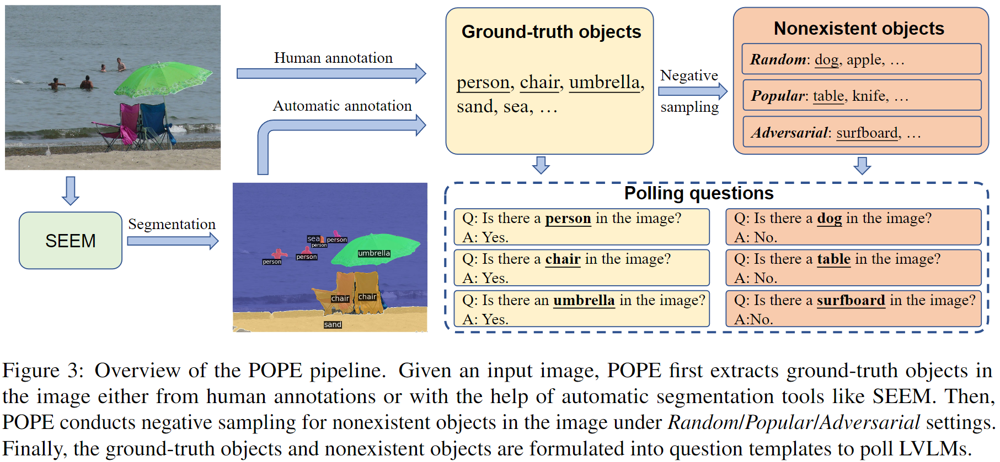

## POPE: Polling-based Object Probing Evaluation for Object Hallucination

This repo provides the source code & data of our paper: Evaluating Object Hallucination in Large Vision-Language Models (Arxiv 2023).

Our code will be public soon.

```
@InProceedings{Li-hallucination-2023,
  author =  {Yifan Li, Yifan Du, Kun Zhou, Jinpeng Wang, Wayne Xin Zhao and Ji-Rong Wen},
  title =   {Evaluating Object Hallucination in Large Vision-Language Models},
  year =    {2023},  
  journal={arXiv preprint arXiv:2305.10355},
  url={https://arxiv.org/pdf/2305.10355}
}
```



