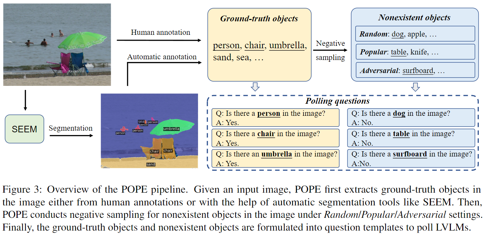

## POPE: Polling-based Object Probing Evaluation for Object Hallucination

This repo provides the source code & data of our paper: Evaluating Object Hallucination in Large Vision-Language Models (Arxiv 2023).

Our code will coming soon.

```

```



